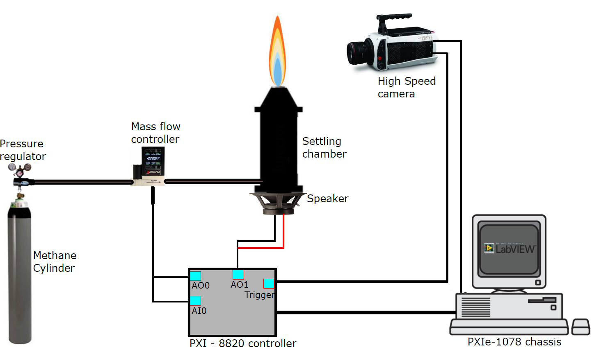
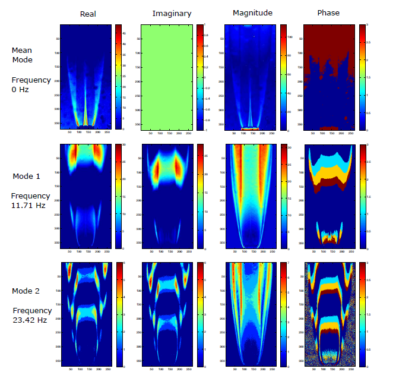

## Project Summary
The Project focused on analyzing the flame response through time series data extraction, including Fast Fourier Transform, Spectrogram, and Dynamic Mode Decomposition. Investigated hydrodynamic instability and forcing response of flames, observing various dynamic states such as period-2 oscillations and mode locking. Identified scaling relationship between Strouhal and Froude numbers using minor diameter as characteristic length.

Key Activities: 
1. Designed and fabricated the flame chamber & experimental setup using Solidworks.
2. Programmed a LabView code to run the  facility, taking into consideration valve operations, camera trigger and acoustic distubance trigger.
  
3. Developed an image processing based MATLAB code for extraction of dynamic modes of flame from schlieren images and further post processing of the data.
  
### Conclusion
Received A+ for the final year project and a conference paper at NAPC-108 was published based on the scaling findings.