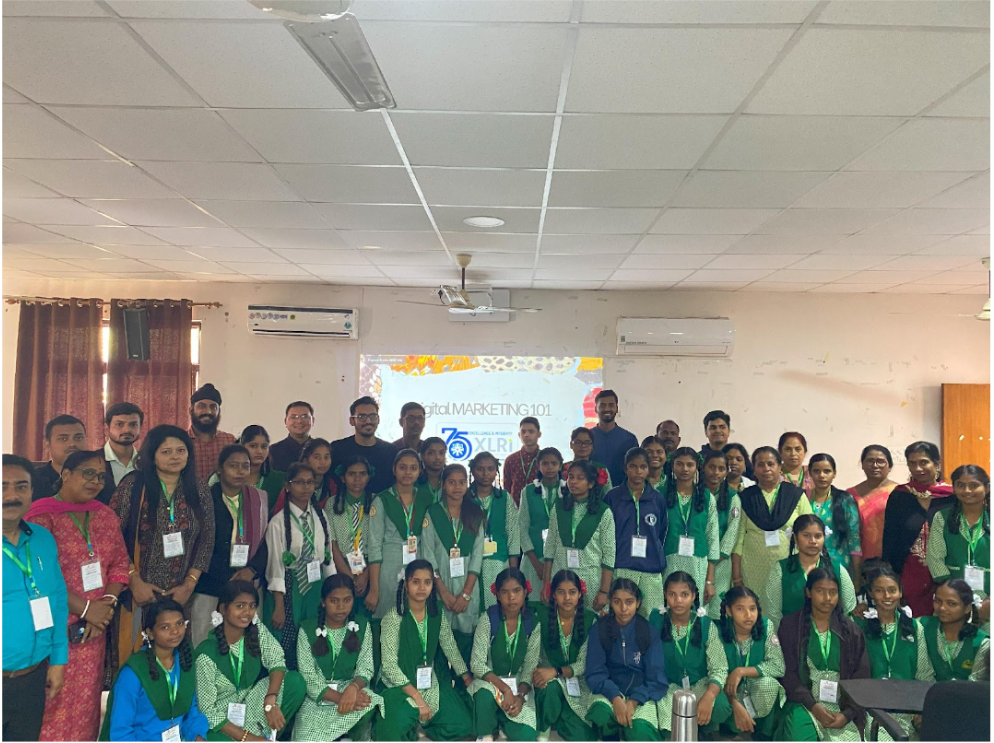

In an initiative by the Ministry of Education, Jharkhand, MBA students from XLRI (Xavier School of Management) recently conducted a Digital Marketing workshop to empower the region's artistic schoolchildren. Aligning with the "Child Art Exhibition" held in Ranchi from November 3rd to 5th, the workshop was part of an event inaugurated by Chief Minister Mr. Hemant Soren, themed "Earning for Learning."

   

The two-day workshop, led by six adept MBA students, equipped the young artists with the tools to showcase and monetize their artwork digitally. It focused on leveraging online marketplaces like Amazon and harnessing social media platforms like Facebook and Instagram to enhance their selling networks and audience reach.
A hands-on session on Canva enabled these child artists to create captivating digital portfolios. At the same time, an introduction to AI tools like ChatGPT and BingAI illuminated paths for innovative marketing strategies—this educational experience aimed at bridging the gap between traditional artistry and the digital marketplace.
This initiative from XLRi was under the program of Jharkhand Young Innovators (JYI), aimed at helping the young talent of Jharkhand through continued efforts.
