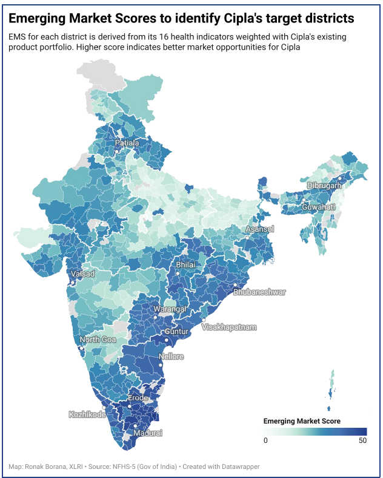

## Cipla 4 India: Spearheading Cipla's business in the new India

### Project Summary:

This project focused on identifying new markets and stakeholders for Cipla, a leading pharmaceutical company, in non-urban geographical regions of India. We developed a mathematical model called the Emerging Markets Score (EMS) using 16 government health indicators for each district and matched them with Cipla's product portfolio to pinpoint high-potential markets.  The EMS model assigns a score from 0-50 to each district, with higher scores indicating greater market potential for Cipla's existing products. 

   

To ensure the effectiveness and synergy of our recommendations, we evaluated their impact on Cipla's key stakeholders, including patients & consumers, channel partners, healthcare professionals, communities, and institutional & government entities.    

The project also proposed a range of targeted interventions under the "Cipla 4 India" model to address the multifaceted challenges of penetrating the tier 2+ and rural markets, which constitute approximately 80% of India.  These interventions included:   

* For Patients and Consumers: Telemedicine collaborations to increase healthcare access, and targeted online marketing of OTC products.    

* For Communities: Health camps to increase brand awareness and promote preventive healthcare, and targeted programs similar to Novartis's Arogya Parivar to boost sales and serve community health needs.    

* For Healthcare Professionals: Awareness and education initiatives through seminars, newsletters, and medical representative (MR) activities, as well as gathering market information and patient behavior insights from tier 2+ doctors.    

* For Channel Partners: Partnerships with e-pharmacies to leverage their logistics network and consumer data, and offering credit policies to rural retailers to ensure product availability.    

Furthermore, the project drew insights from the FMCG and telecom industries to optimize Cipla's strategies for the tier 2+ market, such as rethinking product sizes, customizing advertisements, simplifying products, and leveraging existing logistics channels.    

Finally, the project explored the potential of entering the pharmacy business and using technology to tap into emerging markets, recommending collaboration with existing hospital and pharmacy chains and leveraging blockchain for product authentication and data analytics to enhance sales and marketing efforts. 

### Conclusion
Awarded as the National Runner-up for the case competition among 50+ submission from top B-schools. Received INR 60k as cash prize.

### References
1. https://www.financialexpress.com/healthcare/healthtech/how-technology-is-driving-the-indian-pharma-industry-towards-holistic-product-led-solutions/2579659/
2. https://media-publications.bcg.com/india/Re-Imagining-FMCG-in-India.pdf)
3. https://www.iqvia.com/-/media/iqvia/pdfs/india/presentations/indian-pharmaceutical-market-quarterly-insights-q3-2021.pdf?_=1660891113719
4. https://www.bain.com/client-results/pharma-go-to-market-strategy/

