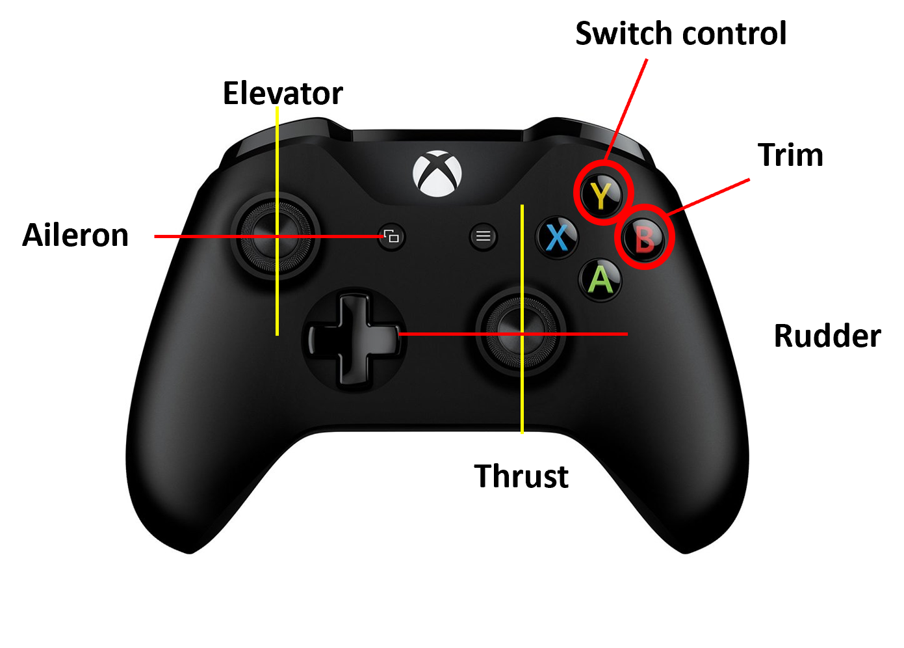
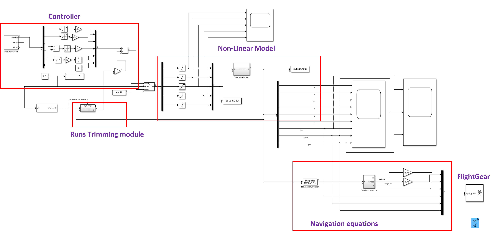

# Abstract

## Aim
The aim of this project was to integrate the MATLAB/Simulink Non-Linear model of the Research Civil Aircraft Model (RCAM) with an Xbox controller and FlightGear package for visualization, alongside the integration of a trimming module to enhance user control.

### Background Information
- **RCAM:** Research Civil Aircraft Model from GARTEUR [1]
- **Non-Linear Model:** A NL model formulated based on data from [1] for 9 states and 5 control inputs.
- **Trimming Module:** An optimization-based approach was used to trim the aircraft about a set point. Constraints were converted to penalty functions and solved using the "fminsearch" function in MATLAB [2].
- **Navigation Equation:** Navigation equations along with geodetic coordinates calculation were employed to determine the location and orientation of the aircraft in FlightGear's [3] coordinates.
- **Hardware:** Wireless controller for Xbox One, Model 1708

## Approach
- **Integrating and processing Xbox input:** Utilized the Pilot Joystick block from Aerospace Toolbox to integrate the hardware with Simulink. Manual mapping of joysticks with control inputs was performed due to the specific controller requirements. A dead zone of 20% was provided for each input, and a switch block allowed toggling between user inputs and predefined inputs.
- **Trimming Module and trigger:** Developed the trimming module with constraints on airspeed, flight path angle, and heading 𝜓. Optimization was carried out using the "fminsearch" function in MATLAB with specific tolerances and maximum iterations. 
- **Simulink block:** Assembled all components into a Simulink block.

## Results and Discussion
1. **Input:** The model reproduced user inputs in simulation, and the trimming trigger functioned as expected. The switch block effectively toggled between user and predefined control inputs.
2. **Flying at trim conditions:** The model exhibited steady stable flight when initialized at trim conditions with trimmed control inputs. Disturbances were handled efficiently, with smaller disturbances quickly attenuated and larger disturbances leading to long-period oscillatory motion (Phugoid mode).
3. **Trimming the aircraft:** The trimming module, triggered by a specific button press, trimmed the aircraft for the current airspeed, flight path angle, and heading. It was crucial to maintain states close to the required trimmed state to achieve steady flight.
4. **Trimming with single engine:** Trimming with a single engine presented challenges due to the need to set all angular rates to zero. To address this, the trimming module was run offline, and the trimmed state was calculated, enabling successful trimming initiation multiple times.

## Conclusion
The integration of the RCAM aircraft model with an Xbox controller and FlightGear visualization, along with a trimming module, demonstrated successful user control and stable flight conditions. Despite challenges, strategic trimming strategies were employed to address them, paving the way for enhanced aircraft simulation and control methodologies.

## References
1. Robust Flight Control Design Challenge Problem Formulation and Manual: the Research Civil Aircraft Model (RCAM) by FM(AG08), GARTEUR/TP-088-3/, February 17, 1997
2. MATLAB 2023b, MathWorks, Natick, MA
3. Flight Mechanics Video Series by Christopher Lum [Youtube Playlist](https://www.youtube.com/playlist?list=PLxdnSsBqCrrEx3A6W94sQGClk6Q4YCg-h)
4. FlightGear 2020.3, FlightGear developers & contributors
